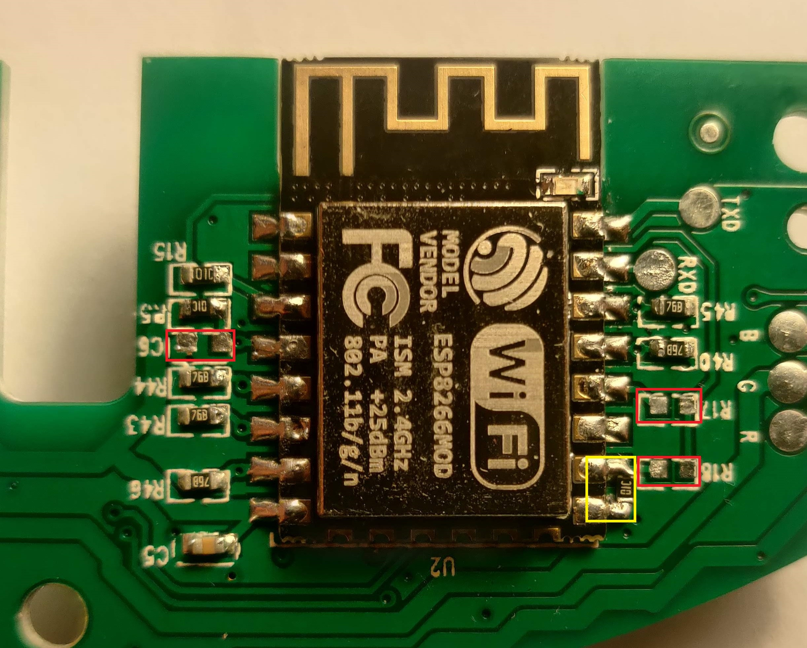

# SmartStarProjector-ESP-Mod
This Repository contains the code and instructions needed to free a Tuya Smart-Star-Projector(SSP) from the cloud, by replacing the WB3S MCU with a ESP8266. This enables control over MQTT.

**Warning! You will have to physically open the device and replace the MCU, this will void your warranty.**

## Installation
- Make sure you have a Tuya Smart Star Projector SK20 and a ESP8266 board using a ESP8266 12-E chip.
- Change Wifi and MQTT Settings in the code
- Flash firmware on ESP8266 board like WEMOS or NODEMCU
- Open the SSP and remove the WB3S MCU
- Remove the ESP8266 from the WEMOS board and solder it onto the SSP PCB
- Remove  R17, R18 and C6 from the SSP PCB as shown on the Image below (red box)
- Use the salvaged R17,R18 or another 10k resistor to pull GPIO15 down to ground (yellow box), without this change the ESP8266 won't boot

## Usage
 You can now control the SSP by sending the following Json to the CMD_TOPIC as defined in your code. This can be done by HA or Node-Red for example.
 
     {
              "power_state": false,
              "status_led": false,
              "red": 0,
              "motor": 0,
              "green": 0,
              "laser": 0,
              "blue": 0,
    }
    
Exept for power_state and status_led which both are booleans, every other value has to be in the range between 0(off) and 255(full on).
Every time a command is received or the power button on the device is pressed, the current state is published on the STATE_TOPIC as defined in your code.

## Used Pins

| ESP8266 GPIO | Function on the PCB|
| ------ | ------ |
| 4 | Red main LED |
| 12 | Green main LED |
| 14 | Blue main LED |
| 5 | Laser |
| 13 | Motor |
| 15 | Red status LED |
| 0 | Blue status LED |
| 16 | On/Off Button |

## License

MIT
